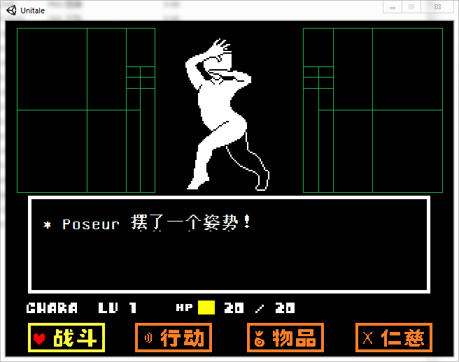

# UniFontMaker
A font maker for Unitale/CYF (and Minecraft resource pack). WIP.  
Unitale/CYF 字体制作器  

`master` 分支是给 Unitale/CYF 字体用的，可以编译使用  
`remake` 分支目前在重写

`CharacterTemplate` 文件夹下面是常用的字符模板  

## 下载 Download
[Github Releases](https://github.com/XcantloadX/UniFontMaker/releases)
[百度网盘](https://pan.baidu.com/s/14wqZHakmU3nL1mBO7u6E3g)（提取码: u5n1）

## 示例 Example
示例 Mod 在 ChineseExampleMod 文件夹里  

## 使用说明 How to use
见 [Wiki](https://github.com/XcantloadX/UniFontMaker/wiki/%5BChinese%5D-%E4%BD%BF%E7%94%A8%E6%95%99%E7%A8%8B)